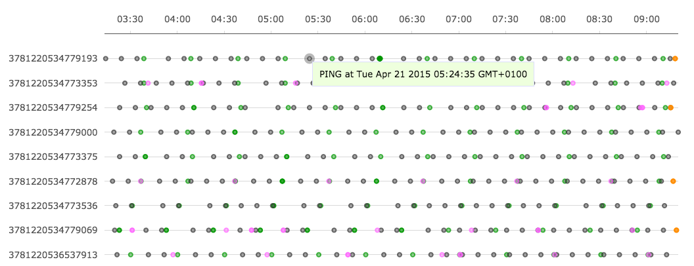
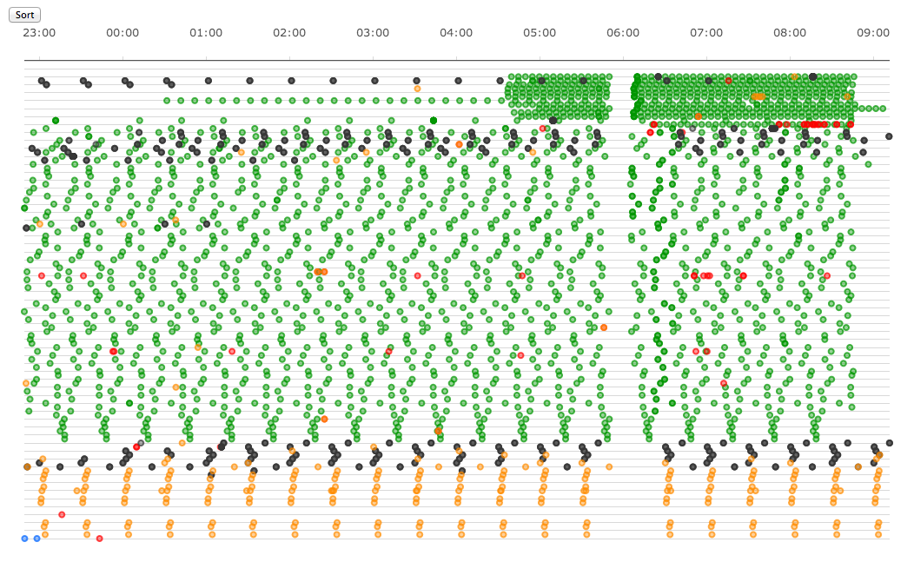

# Timeline

Timeline is a Javascript Library for visualising discrete events.  Each event is plotted as a coloured dot or horizontal bar.  Time runs horizontally, and the user can define a set of horizontal "lines" on which to group data.

Drag horizontally to zoom in, and double click to reset the zoom. Hover over a point for a tooltip. 



This library is mainly used to visualise log files, allowing a user to quickly spot patterns and sequences of events in large datasets:



Timeline is based on [Flot](http://www.flotcharts.org) (which in turn is based on [JQuery](http://jquery.com)).

## Basic Example
	<div id="placeholder" style="width:90%;height:200px;"></div>
    
	<script type="text/javascript">

		var categories = {
			'alarms': {'color': "rgba(255, 0, 0, 0.7)"},
			'pings': {'color': "rgba(54, 54, 54, 0.7)", 'hoverable': false},
		};

		var events = [
			{'time': 1398706972000, 'category': 'alarms', 'line': 12345, 'label': "one"},
			{'time': 1398706771300, 'category': 'pings', 'line': "fred", 'label': "two"},
		];
	
		var options = {'categories': categories};
		var timeline = Timeline('#placeholder', events, options);
	</script>

See [demo.html](demo.html) for a more detailed example.

## Event Data
Each object in the *events* array passed to *Timeline* must have the following attributes:

* *time*: unix timestamp in milliseconds or a [Moment](http://momentjs.com) object.
* *category*: an index into the categories list in the options object.
* *line*: a unique identifier indicating which horizontal line to plot the event on.

In addition, each event can have the following optional attributes: 

* *label*: Text to display when the cursor hovers over the point.  If *hoverable* has been set to **false** for this category in the *categories* option then this will be ignored.
* *endTime*: Makes the event have a duration, with start and end times indicated by points, joined by a solid line.  

## Options
The Timeline plot is configured using the *options* object that is passed in (this is inspired by the Flot API).  The options object currently supports the following attributes:

* categories
* lines
* lineLabels
* sortLines

These are discussed individually below. The only compulsory attribute in the options object is the *categories* object.

## Categories and Colours
Each event must have a `category` attribute corresponding to one of the attributes of `options.categories`.  A category is like a data series, and defines the colour of the event dots and other properties (see Basic Example above).

The `options.categories` objects are passed directly to Flot to specify the data series properties.  The two attributes that are usually useful to set are *color* and *hoverable*.

Any valid Flot colour spec can be used, but it is often best to stick to transparent colours so that overlapping dots can be seen more clearly.  Here are some typical colours, all at 70% opacity:

	var red = "rgba(255, 0, 0, 0.7)";
	var orange = "rgba(255, 140, 0, 0.7)";
	var green = "rgba(0, 150, 0, 0.7)";
	var blue = "rgba(0, 100, 255, 0.7)";
	var purple = "rgba(255, 100, 255, 0.7)";
	var grey = "rgba(54, 54, 54, 0.7)";

Set the *hoverable* attribute to **false** if you don't want to display tooltips for this category.  If you don't set this attribute then it defaults to **true** and tooltips will be displayed.

## Lines
Each event needs to have a `line` attribute specifying which horizontal line of the plot it should be displayed on.  This can be any unique identifier, though strings and integers are the most common options.xs`.

If you don't specify a lines list, Timeline will automatically identify the unique lines from the data itself and plot them in the order in which they are encountered (bottom to top).  However, if you have a predefined list of lines and you want to preserve its order, or you want to plot lines even if they don't have any events, then the list of lines for the plot can be specified by adding a "lines" array to the options object:

		var timeline = Timeline('#placeholder', events, 
		{
			'categories': categories,
			'lines': ["one", "two", 1234, "fred"],
		});

Unless you specify `sortLines`  (see below) the lines will be displayed in the order specified, from the bottom of the plot to the top.  

## Line Labels
Set `options.lineLabels = ["one", "two"]` to display labels at the left hand end of each line.  It is best to also specify the lines list (`options.lines`, see above) if you do this so that you know the labels are in the same order as your lines.

The *lineLabels* can be HTML fragments, such as link tags.  To style these, use the `flot-y-axis` CSS class.

If the *lineLabels* array you specify isn't long enough to label all the lines then the line identifiers are used to label the remaining lines.  Therefore, to use the line identifiers as labels for all lines, you can just set `lineLabels = []`.

If you don't specify a `lineLabels` option (or set `lineLabels = false`) then no lines will be labelled.  

## Sorting
Timeline can automatically sort the lines by the number of events on each line, so that lines with lots of events are displayed together.  Sorting is disabled unless the *sortLines* option object is included.

The simplest way to enable sorting is to specify `options.sortLines = {}`.  This will sort the lines by the total number of events on each line, with the busyest at the top.

Sort order can be adjusted using `options.sortLines.direction = "ascending"` or `"descending"`.  The default is descending, i.e. lines with more events will be displayed at the top.

Specify `options.sortLines.categories = ["one", "two"]` to sort lines by the number of events of category "one", and then by the number of events of category "two".  If you omit `options.sortLines.categories` then Timeline will sort by the total number of events on each line.

## Tooltips
If an event has a *label* attribute (and the category is not set `hoverable=false`) then a tooltip contain the *label* will be displayed when the user hovers over that event's dot.  

## Line Spacing
You must specify an absolute height for the placeholder `div` element containing the plot.  If the height you specify is too small, the lines on the plot will be too close togther and the line labels will be unreadable.  

A quick way to ensure that the plot is (just about) large enough is to set the height in `em` equal to the number of lines:

```
$('#placeholder').css('min-height', lines.length + 'em');
```

## Customised Flot Library

There is a [known bug](https://github.com/flot/flot/issues/1321) in the current version of Flot (0.8.3) which means that the `overlay` canvas overlaps the axis labels, meaning that you can't click on axis labels which are links.  

This has been fixed in a customised version of Flot, which is included with the Timeline library.  Ensure that you use the special versions of both the main Flot library and the Selection plugin.  If you use the normal versions of these files then you will not be able to click on line labels which are links.  

